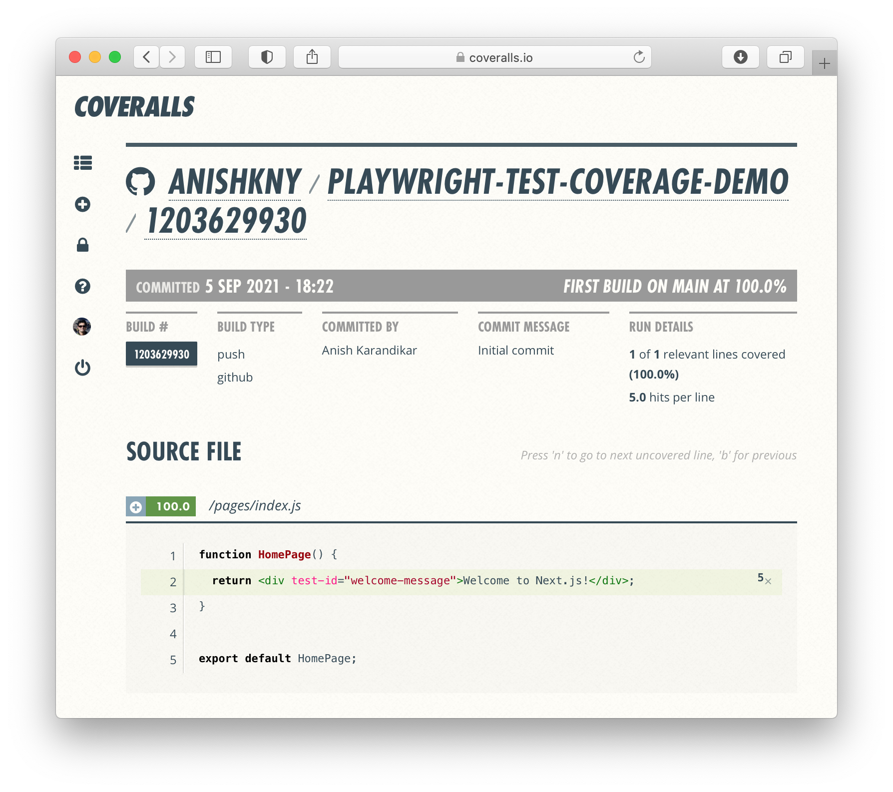

# Playwright Test Coverage Demo

[](https://coveralls.io/github/anishkny/playwright-test-coverage-demo?branch=main)
[](https://depfu.com/github/anishkny/playwright-test-coverage-demo?project_id=37920)

Demonstrates usage of [playwright-test-coverage](https://github.com/anishkny/playwright-test-coverage) - a [Playwright](https://playwright.dev) extension that collects code coverage from running end-to-end tests.

Read more in this [blog post](https://dev.to/anishkny/code-coverage-for-a-nextjs-app-using-playwright-tests-18n7).

## Usage

```bash
npm install
npm test
```

Code coverage should be generated in `coverage/` folder.

## Sample

[](https://coveralls.io/builds/42662804/source?filename=pages/index.js)

## License

[MIT](https://choosealicense.com/licenses/mit/)
